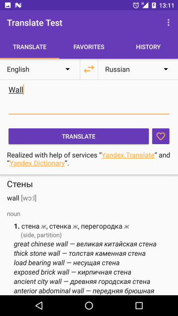

# Translate Test

#### Test application for [Yandex Mobilization](https://yandex.ru/mobilization/) — School of mobile development.

## Features

### Primary

1. Translation from Yandex.Translate.
2. History of translations.
3. Adding translations to favorite list.

### Secondary

4. Extended definition from Yandex.Dictionary.
5. Detecting input langage.
6. Most used languages pinning.
7. Search by history and favorites.
8. History and favorites deletion (item-by-item and all at once).
9. UI translated to English and Russian languages.

## API Keys

For use application, you need to get API keys for [Yandex.Translate](https://tech.yandex.com/keys/get/?service=trnsl) and [Yandex.Dictionary](https://tech.yandex.com/keys/get/?service=dict).

## License information

Application licensed by [WTFPL](http://www.wtfpl.net/).

Realized with help of services ["Yandex.Translate"](http://translate.yandex.ru/) and ["Yandex.Dictionary"](https://tech.yandex.ru/dictionary/).

Component licenses:

__Retrofit__ — http://square.github.io/retrofit/#license

__Jackson__ — http://www.apache.org/licenses/LICENSE-2.0.txt

__Butterknife__ — https://github.com/JakeWharton/butterknife/blob/master/LICENSE.txt

__Moxy__ — https://github.com/Arello-Mobile/Moxy/blob/master/LICENSE

__GreenDAO__ — http://www.apache.org/licenses/LICENSE-2.0.txt

__Dagger 2__ — https://github.com/square/dagger/blob/master/LICENSE.txt

__Launcher Icon__ designed by __Freepik__ from http://flaticon.com